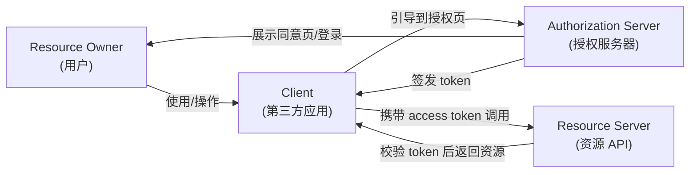
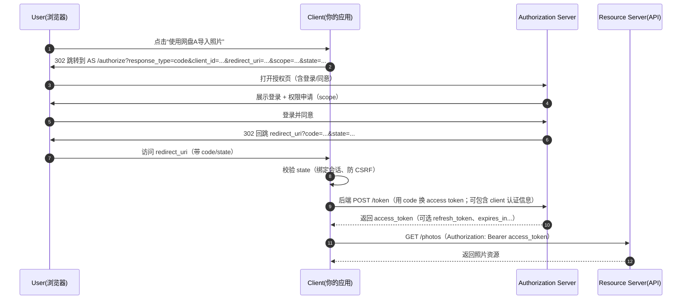

# OAuth 2.0 核心概念速览

参考规范：RFC 6749（OAuth 2.0 Authorization Framework）
- https://datatracker.ietf.org/doc/html/rfc6749

这篇文档的目标：用“为什么需要它”的直觉例子，解释 OAuth 2.0 的核心角色、令牌、Scope、授权流程（重点：Authorization Code），并给出可渲染的流程图。

---

## 1. 先用一个直觉例子：为什么要有 OAuth？

### 例子：你想用“某 App”打印你的网盘照片

你有照片在「网盘 A」里，同时你想用「照片打印 App」下单。

朴素但糟糕的做法：
- 你把网盘账号密码直接告诉照片打印 App。

这个做法的问题：
- **权限过大**：App 拿到的是“你的全部账号能力”，不仅能读照片，可能还能删文件、改密码。
- **不可控**：你很难只给它“一部分权限”，也很难只授权“3 天”。
- **难撤销**：你想收回权限时，只能改密码（同时影响你自己和其它设备）。
- **难审计**：网盘侧看到的都是“你本人登录”，很难区分到底是哪个 App 在操作。

OAuth 2.0 的核心动机：
- 让你**不用把密码交给第三方 App**
- 让授权**可最小化（Scope）**、**可过期（token lifetime）**、**可撤销（revocation）**
- 让资源方能**识别“哪个客户端”在使用授权**（client_id 等）

一个常见类比：
- 把账号密码看成“家门钥匙（全权限）”
- OAuth 2.0 发放的 Access Token 更像“**限定权限、可过期、可撤销的临时通行证**”（可只进客厅，不给卧室；只用一天；随时作废）

---

## 2. OAuth 2.0 解决的“边界”是什么？

OAuth 2.0 主要解决的是：
- **授权（Authorization）**：允许某个客户端以受控方式访问资源

OAuth 2.0 不等同于：
- **身份认证（Authentication）**：证明“你是谁”

实际工程里经常把 OAuth 2.0 和 OpenID Connect（OIDC）搭配使用：
- OAuth 2.0 发“访问资源的票”
- OIDC 在 OAuth 2.0 基础上补充“登录身份”的标准方式（例如 `id_token`）

---

## 3. 四个核心角色（Roles）

在 OAuth 2.0 里，最常见的四个角色：

- **Resource Owner（资源所有者）**：通常是最终用户（你）
- **Client（客户端）**：要访问资源的应用（照片打印 App）
- **Authorization Server（授权服务器）**：负责登录、弹授权页、签发 token（网盘的授权中心）
- **Resource Server（资源服务器）**：真正存资源的 API（网盘照片 API）

一个直觉解释：为什么要把授权服务器和资源服务器拆开？
- 资源服务器只需要专注“保护资源 + 校验 token”
- 授权服务器专注“登录 + 交互式授权 + 发 token + 管理客户端”
- 这样更容易做统一登录、统一风控、统一审计，以及更安全的 token 签发策略

---

## 4. 两类关键凭证：Authorization Code 与 Token

OAuth 2.0 的几个高频术语：

### 4.1 Authorization Grant（授权许可）
RFC 把“如何获得 token 的方法”称为授权许可（grant）。常见 grant 见后文。

### 4.2 Authorization Code（授权码）
在最常用的授权码模式里，用户在浏览器里同意授权后，授权服务器先给客户端一个 **短期、一次性的 code**。

为什么不直接在浏览器里把 Access Token 发给客户端？（引入 code 的缘由）
- 浏览器跳转链路更容易泄露（历史记录、Referer、日志、脚本、插件等）
- code 本身没法直接调用资源，且通常很短期；拿到 code 还需要再走一次“后端换 token”的受控通道

### 4.3 Access Token（访问令牌）
- 给资源服务器看的“通行证”，用于调用 API
- 典型形态：`Authorization: Bearer <access_token>`

注意：OAuth 2.0 **不要求** access token 必须是 JWT，也不规定 token 内部结构；它只定义了框架与交互。

### 4.4 Refresh Token（刷新令牌）
- access token 过期后，用 refresh token 去授权服务器换新的 access token

为什么需要 refresh token？（引入 refresh token 的缘由）
- 安全上希望 access token **短寿命**（泄露窗口更小）
- 体验上又希望用户**不用频繁重新登录/确认授权**
- refresh token 通常只给“更可信的客户端形态”（比如有后端的服务端应用），并且更强调保密与存储安全

---

## 5. Scope、Consent、Redirect URI、State：看似琐碎但很关键

### 5.1 Scope（权限范围）
- 让授权从“全有或全无”变成“最小必要”
- 例：`photos:read`、`files:read`、`files:write`

为什么需要 scope？
- 你只想让照片打印 App 读照片，不想它删文件
- 资源方也能基于 scope 做审计与风控（例如写权限更严格）

### 5.2 Consent（用户同意页/授权页）
- OAuth 2.0 常见的交互：授权服务器向用户展示“该 App 申请哪些权限”，用户同意/拒绝

### 5.3 Redirect URI（回调地址）
- 授权完成后，授权服务器把浏览器重定向回客户端的某个地址

为什么要强绑定 redirect URI？
- 防止 code/token 被发到攻击者控制的地址（开放重定向、回调劫持）

### 5.4 State（状态参数）
- 客户端发起授权请求时带上 `state`，回调时原样带回

为什么需要 state？
- 主要用于抵御 CSRF（跨站请求伪造）与“把回调绑定到发起会话”
- 直觉：你发起一次授权请求，就像你先拿到一张“带编号的取号单（state）”，回来时必须对得上

---

## 6. 授权流程总览图（角色关系）

下面是一个高层流程图，帮助把四个角色的边界先对齐：

---

## 7. 最重要的具体流程：Authorization Code（授权码模式）

这是今天最常见、也最推荐理解透的流程（尤其是“有后端”的 Web 应用）。

### 7.1 时序图（推荐用这个理解）

### 7.2 一个“能对上号”的参数清单

授权请求（概念上）通常包含：
- `response_type=code`
- `client_id`：客户端标识
- `redirect_uri`：回调地址（需预注册/匹配）
- `scope`：申请的权限
- `state`：客户端生成的随机值（绑定会话、抗 CSRF）

换 token 请求（概念上）通常包含：
- `grant_type=authorization_code`
- `code`：上一步拿到的授权码
- `redirect_uri`：与前面一致（很多实现要求一致）
- 客户端认证信息（例如 `client_secret` 或其它方式；不同客户端类型策略不同）

---

## 8. 常见 Grant 类型（知道名字 + 适用场景即可）

RFC 6749 定义了多种 grant。实践中你会遇到：

- **Authorization Code Grant**：最常见；浏览器拿 code，服务端换 token
- **Implicit Grant**：历史上给纯前端用；现代最佳实践里通常不再建议（更容易暴露 token）
- **Resource Owner Password Credentials Grant**：让用户把密码直接给客户端；现在基本不建议
- **Client Credentials Grant**：机器对机器（M2M）；没有“用户授权”这一步

提示：后来出现的 PKCE（RFC 7636）常与 Authorization Code 一起使用，用于增强“无 client_secret 的客户端”（如移动端/SPA）的安全性；它不在 RFC 6749 里，但在现代实现中非常常见。

---

## 9. 最小安全检查清单（理解 OAuth 时很有用）

- `state` 必须随机、一次性、绑定用户会话（防 CSRF）
- `redirect_uri` 必须预注册/严格匹配（防回调劫持）
- access token 应短寿命；refresh token 要更谨慎存储与使用
- 授权码（code）应短期、一次性，并与客户端绑定

---

## 10. 一句话总结

OAuth 2.0 的本质是：在不暴露用户密码的前提下，通过授权服务器签发“可控、可撤销、可最小化权限”的 token，让客户端受限地访问资源服务器。
